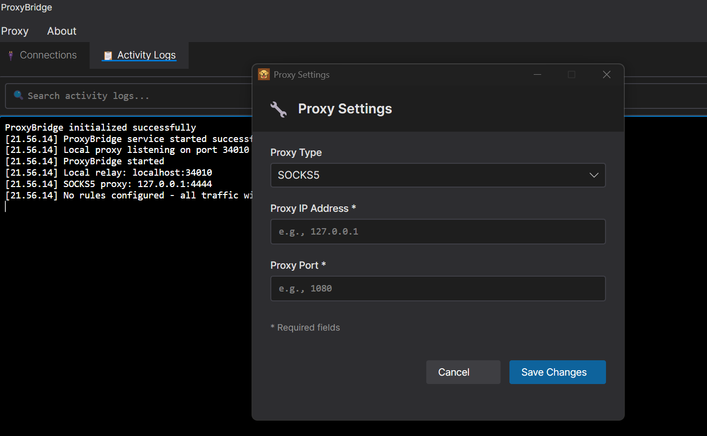
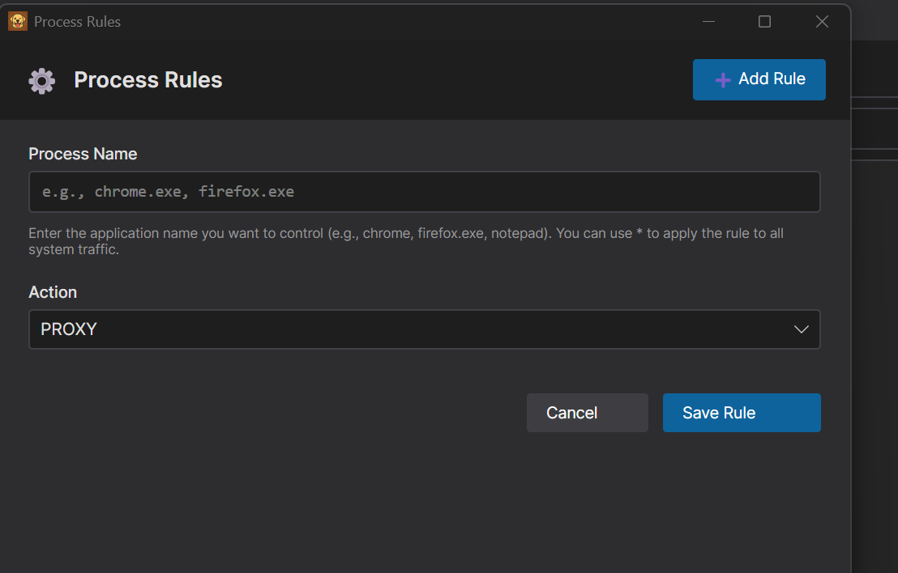
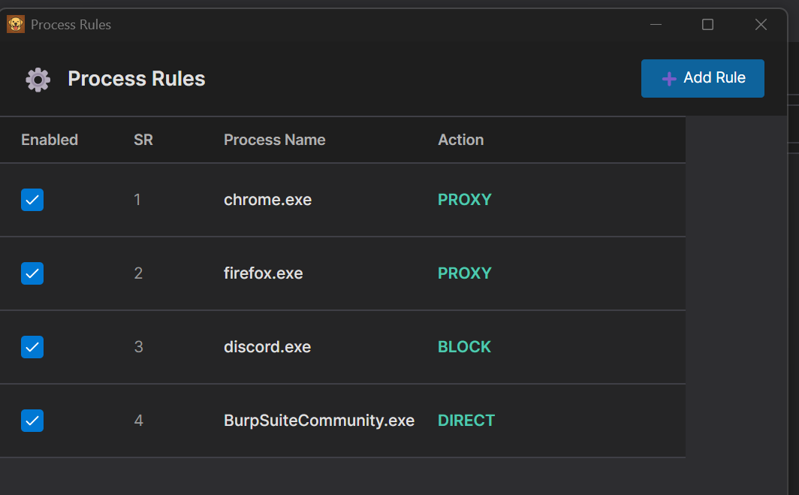
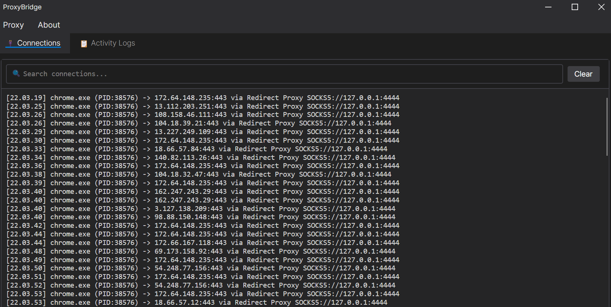

# ProxyBridge

<p align="center">
  
</p>


ProxyBridge is a lightweight, open-source alternative to Proxifier that provides transparent proxy routing for Windows applications. It redirects TCP traffic from specific processes through SOCKS5 or HTTP proxies, with the ability to route, block, or allow traffic on a per-application basis. Working at the kernel level using WinDivert, ProxyBridge is compatible with proxy-unaware applications without requiring any configuration changes.

## Features

- **Dual interface** - Feature-rich GUI and powerful CLI for all use cases
- **Process-based traffic control** - Route, block, or allow traffic for specific applications
- **Universal compatibility** - Works with proxy-unaware applications
- **Multiple proxy protocols** - Supports SOCKS5 and HTTP proxies
- **Kernel-level interception** - Uses WinDivert for reliable packet capture
- **No configuration needed** - Applications work without any modifications
- **Protocol agnostic** - Compatible with any TCP protocol (HTTP, HTTPS, databases, RDP, SSH, etc.)
- **Traffic blocking** - Block specific applications from accessing the internet
- **Flexible rules** - Direct connection, proxy routing, or complete blocking per process
- **Process exclusion** - Prevent proxy loops by excluding proxy applications

## Table of Contents

- [Installation](#installation)
- [Usage](#usage)
  - [GUI Application](#gui-application)
    - [Proxy Settings](#proxy-settings)
    - [Process Rules](#process-rules)
    - [Activity Monitoring](#activity-monitoring)
  - [Command Line Interface (CLI)](#command-line-interface-cli)
    - [Basic Usage](#basic-usage)
    - [Command Line Options](#command-line-options)
    - [Rule Examples](#rule-examples)
- [Use Cases](#use-cases)
- [Current Limitations](#current-limitations)
- [How It Works](#how-it-works)
- [Build from Source](#build-from-source)
- [License](#license)
- [Author](#author)
- [Credits](#credits)

## Installation

1. Download the latest `ProxyBridge-Installer-vX.X.X.exe` from the [Releases](https://github.com/InterceptSuite/ProxyBridge/releases) page
2. Run the installer with Administrator privileges
3. The installer will:
   - Install ProxyBridge to `C:\Program Files\ProxyBridge`
   - Add the CLI to your system PATH for easy command-line access
   - Create Start Menu shortcuts for the GUI application
   - Include all required dependencies (WinDivert driver)


## Usage

### GUI Application

Launch `ProxyBridge.exe` (GUI) with Administrator privileges for an intuitive graphical interface to:

#### Proxy Settings

<p align="center">
  
</p>

1. Click **Proxy** tab in the main window
2. Click **Proxy Settings** from the menu
3. Select **Proxy Type** (SOCKS5 or HTTP)
4. Enter **Proxy IP Address** (e.g., 127.0.0.1)
5. Enter **Proxy Port** (e.g., 1080 for SOCKS5, 8080 for HTTP)
6. Click **Save Changes**

#### Process Rules

<p align="center">
  
</p>

<p align="center">
  
</p>

1. Click **Proxy** tab in the main window
2. Click **Proxy Rules** from the menu
3. Add process rules with actions:
   - **PROXY** - Route through configured proxy
   - **DIRECT** - Allow direct internet access
   - **BLOCK** - Block all internet access
4. Enter process name
      - Use `*` as wildcard to set default action for all processes
      - or Appname like chrome or chrome.exe
5. Click **Save** to apply rules

#### Activity Monitoring

<p align="center">
  
</p>

- View real-time connection activity in the **Connections** tab
- Monitor which processes are active and their routing status
- Search and filter connections using the search box

**Important:** The GUI automatically saves your configuration and restores it on next launch.

**Note:** Adding a rule with action **PROXY** while no proxy is configured will result in traffic being routed through a direct connection instead. Make sure to configure proxy settings before using PROXY rules.

### Command Line Interface (CLI)

The CLI provides powerful automation and scripting capabilities with rule-based traffic control:

#### Basic Usage
```powershell
# Help menu
ProxyBridge_CLI -h

# Use custom HTTP proxy
ProxyBridge_CLI --proxy http://192.168.1.100:8080

# Route Chrome through socks5 proxy
ProxyBridge_CLI --proxy socks5://127.0.0.1:1080 --rule "chrome.exe=proxy"

# Block specific application from internet access
ProxyBridge_CLI --rule "chrome.exe=block"

# Route specific apps through proxy, block everything else
ProxyBridge_CLI --rule "chrome.exe=proxy;firefox.exe=proxy;*=block"

# Route all through proxy except proxy app itself
ProxyBridge_CLI --rule "*=proxy;BurpSuiteCommunity.exe=direct"

```

#### Command Line Options
```
ProxyBridge_CLI -h

  ____                        ____       _     _
 |  _ \ _ __ _____  ___   _  | __ ) _ __(_) __| | __ _  ___
 | |_) | '__/ _ \ \/ / | | | |  _ \| '__| |/ _` |/ _` |/ _ \
 |  __/| | | (_) >  <| |_| | | |_) | |  | | (_| | (_| |  __/
 |_|   |_|  \___/_/\_\\__, | |____/|_|  |_|\__,_|\__, |\___|
                      |___/                      |___/  V1.1

  Universal proxy client for Windows applications

        Author: Sourav Kalal/InterceptSuite
        GitHub: https://github.com/InterceptSuite/ProxyBridge

A lightweight proxy bridge for process-based traffic routing

USAGE:
    ProxyBridge_CLI [OPTIONS]

OPTIONS:
    --proxy <url>       Proxy server URL
                        Format: socks5://ip:port or http://ip:port
                        Default: socks5://127.0.0.1:4444

    --rule <rules>      Traffic routing rules (semicolon-separated)
                        Format: process=action;process=action
                        Actions: PROXY, DIRECT, BLOCK
                        Example: --rule "chrome.exe=proxy;firefox.exe=direct;*=block"

    --help, -h          Show this help message

EXAMPLES:
    Start with default SOCKS5 proxy:
        ProxyBridge_CLI

    Use custom HTTP proxy:
        ProxyBridge_CLI --proxy http://192.168.1.100:8080

    Route specific processes:
        ProxyBridge_CLI --proxy socks5://127.0.0.1:1080 --rule "chrome.exe=proxy;*=direct"

    Block all traffic except specific apps:
        ProxyBridge_CLI --rule "chrome.exe=proxy;firefox.exe=proxy;*=block"

NOTES:
    - Press Ctrl+C to stop ProxyBridge
    - Use * as process name to match all traffic
    - Process names are case-insensitive

```

#### Rule Examples
```powershell
# Single process rule
--rule "chrome.exe=proxy"

# Multiple processes with different actions
--rule "chrome.exe=proxy;firefox.exe=direct;malware.exe=block"

# Default action for all unmatched processes
--rule "chrome.exe=proxy;*=direct"

# Whitelist approach (block everything except specific apps)
--rule "chrome.exe=proxy;firefox.exe=proxy;*=block"
```

**Notes:**
- After installation, the CLI is available from any terminal (no `.\` prefix needed)
- Process names are case-insensitive
- Use `*` as the process name to set a default action for all traffic
- Press `Ctrl+C` to stop ProxyBridge

## Use Cases

- Redirect proxy-unaware applications (games, desktop apps) through InterceptSuite/Burp Suite for security testing
- Route specific applications through Tor,SOCKS5 or HTTP proxies
- Intercept and analyze traffic from applications that don't support proxy configuration
- Test application behavior under different network conditions
- Analyze protocols and communication patterns


## Current Limitations

- IPv4 only (IPv6 not supported)
- TCP only (UDP not supported)
- IP and Port based Routing


## How It Works

```
                                    Your Application
                                 (Chrome, Discord, etc.)
                                    Proxy-Unaware
                                          |
                                          | (1) Raw TCP Packets
                                          v
[user mode]                               |
...........................................+...........................................
[kernel mode]                             |
                                          v
                              +------------------------+
                              |   WinDivert.sys        |
         (1) All packets ---->|   (Kernel Driver)      |
         intercepted          |   - Intercepts ALL TCP |
                              +------------------------+
                                          |
                                          | (2) Sends ALL packets to ProxyBridge
                                          v
...........................................+...........................................
[kernel mode]                             |
[user mode]                               v
                              +------------------------+
                              | ProxyBridge.exe        |
                              | Packet Handler         |
                              | - Checks process name  |
                              | - Matches target?      |
                              +------------------------+
                                    |            |
                     (matching)     |            | (non-matching)
                     redirect       |            | re-inject unchanged
                                    |            |
                                    |            +-------------------> Internet
                                    |                                (direct connection)
                                    | (3) re-inject with modified
                                    |     destination: localhost:37123
                                    v
                              +------------------------+
                              | ProxyBridge            |
                              | TCP Relay Server       |
                              | (localhost:37123)      |
                              | - Tracks origin        |
                              | - Converts TCP to      |
                              |   SOCKS5/HTTP protocol |
                              +------------------------+
                                    |
                                    | SOCKS5/HTTP CONNECT
                                    v
                              +------------------------+
                              | Proxy Server           |
                              | (Burp/InterceptSuite)  |
                              | 127.0.0.1:8080/4444    |
                              +------------------------+
                                    |
                                    | Proxied Traffic
                                    v
                                 Internet
```

**Key Points:**
- WinDivert.sys sits between application and network, intercepts ALL TCP packets
- ALL packets are sent to ProxyBridge in user space for inspection
- ProxyBridge checks process name and decides: redirect or forward unchanged
- Matching packets are re-injected with destination changed to localhost:37123
- Non-matching packets are re-injected unchanged and go directly to Internet
- TCP Relay Server converts raw TCP to SOCKS5/HTTP proxy protocol
- This allows proxy-unaware apps to work with proxy servers


## Build from Source


### Requirements

- Windows 7 or later (64-bit)
- Administrator privileges (required for WinDivert driver)
- WinDivert 2.2.2-A or later
- GCC (MinGW-w64) or MSVC compiler

If you prefer to build ProxyBridge from source:

1. Download WinDivert 2.2.2-A from the [official website](https://reqrypt.org/windivert.html)
2. Extract WinDivert to a known location (e.g., `C:\WinDivert-2.2.2-A`)
3. Clone or download ProxyBridge source code
4. Compile using one of the methods below:

### Using PowerShell Script
```powershell
.\compile.ps1
```

### Using GCC Directly
```powershell
gcc -O2 -Wall -D_WIN32_WINNT=0x0601 -I"C:\WinDivert-2.2.2-A\include" ProxyBridge.c -L"C:\WinDivert-2.2.2-A\x64" -lWinDivert -lws2_32 -liphlpapi -o ProxyBridge.exe
```

5. Run `ProxyBridge.exe` with Administrator privileges

## License

MIT License - See LICENSE file for details

## Author

Sourav Kalal / InterceptSuite

## Credits

This project is built on top of [WinDivert](https://reqrypt.org/windivert.html) by basil00. WinDivert is a powerful Windows packet capture and manipulation library that makes kernel-level packet interception possible. Special thanks to the WinDivert project for providing such a robust foundation.

Based on the StreamDump example from WinDivert:
https://reqrypt.org/samples/streamdump.html