# ProxyBridge
 **✅ MODIFIED VERSION**  
 This is a forked/modified version of ProxyBridge with 1 simple feature added which is the ability to run the same process, e.g game.exe with a proxy, and a second instance of the same game.exe without a proxy. 
 - Configurable in the UI Proxy -> Proxy Rules -> Edit proxy:
- Purpose: Bypassing RotMG's new "1 account per ip" blocks so we can trading between 2 accounts and use mule accounts for storage
- It's as simple as: you follow steps below to configure ProxyBridge. After it's configured you just open it and leave it running and then just open 2 exalt processes using [Exalt Account Manager](https://github.com/MaikEight/ExaltAccountManager). ProxyBridge will automatically detect your opened .exes and proxy the first RotMG Exalt.exe process through the proxy and DIRECT connect the second instance.

## Step by step:

Requirements: 

_You need a proxy ip, which you can get 10 for free from [webshare.io](https://www.webshare.io/) or other proxy sites. Just make a free account._

### 1. Download the [Release .zip](https://github.com/gkp1/ghost-mule/releases/download/3.2.1/ProxyBridge-Windows-Portable-v3.2.1.zip) and extract it to any folder you want e.g Documents folder (+ send a shortcut of ProxyBridge.exe to your desktop)

### 2. Run ProxyBridge.exe as admin, and allow all network permissions when prompted so it can intercept+proxy requests etc

### 3. Click **Proxy** -> **Proxy Settings** -> Fill your proxy creds from webshare -> **test** -> **Save**:

### 4. Click **Proxy** -> **Proxy Rules** -> **ADD** -> Literally just type **RotMG Exalt.exe** (CASE SENSITIVE) -> **Save**:

- Done. Now whenever you need to mule just open ProxyBridge and run your 2 games and it will auto proxy the first process so you can connect both.

- This is not a proxy rotation which means this is not really made for multiboxing or any sort of 'cheating', I don't plan on adding multi-proxy rotation to this. This is meant to be a simple Deca China's Firewall bypass.

Adds the ability to control how many instances of the same process
can use the proxy (default: 1). First N instances get PROXY, rest
get DIRECT. Includes C core tracking, new APIs, GUI controls, CLI
options, and full documentation.

> + Implemented the following changes:
> - Added portable build scripts (`build-portable.ps1`, `make-portable.ps1`) for creating self-contained zip releases
> - Fixed `compile.ps1` syntax errors for Windows builds
> - Added `SelfContained=true` to GUI project for runtime-independent portable builds
> - Updated build pipeline to properly package WinDivert driver with releases
> 
> **Building from Source:** Requires .NET SDK (download from Microsoft) and WinDivert library (download and extract to `C:\WinDivert-2.2.2-A`). Run `.\build-portable.ps1 -Version "3.2.1"` to create a portable zip. Verify built binary hash with releases using PowerShell: `Get-FileHash releases\ProxyBridge-Windows-Portable-v3.2.1.zip`

  

ProxyBridge is a lightweight, open-source universal proxy client (Proxifier alternative) that provides transparent proxy routing for applications on **Windows**, **macOS**, and **Linux**. It redirects TCP and UDP traffic from specific processes through SOCKS5 or HTTP proxies, with the ability to route, block, or allow traffic on a per-application basis. ProxyBridge fully supports both TCP and UDP proxy routing and works at the system level, making it compatible with proxy-unaware applications without requiring any configuration changes.

> [!TIP]
> **Need advanced traffic analysis?** Check out [**InterceptSuite**](https://github.com/InterceptSuite/InterceptSuite) - our comprehensive MITM proxy for analyzing TLS, TCP, UDP, DTLS traffic. Perfect for security testing, network debugging, and system administration!

## Table of Contents

- [Features](#features)
- [Platform Documentation](#platform-documentation)
- [Screenshots](#screenshots)
- [Use Cases](#use-cases)
- [License](#license)
- [Author](#author)
- [Credits](#credits)

  <strong>💖 Support ProxyBridge Development</strong> 
  <em>If you find ProxyBridge useful, consider sponsoring to support ongoing development and new features!</em>  
  

## Features

- **Cross-platform** - Available for Windows, macOS and Linux
- **Dual interface** - Feature-rich GUI and powerful CLI for all use cases
- **Process-based traffic control** - Route, block, or allow traffic for specific applications
- **Universal compatibility** - Works with proxy-unaware applications
- **Multiple proxy protocols** - Supports SOCKS5 and HTTP proxies
- **System-level interception** - Reliable packet capture at kernel/network extension level
- **No configuration needed** - Applications work without any modifications
- **Protocol agnostic** - Compatible with TCP and UDP protocols (HTTP/HTTPS, HTTP/3, databases, RDP, SSH, games, DTLS, DNS, etc.)
- **Traffic blocking** - Block specific applications from accessing the internet or any network (LAN, localhost, etc.)
- **Flexible rules** - Direct connection, proxy routing, or complete blocking per process
- **Advanced rule configuration** - Target specific processes, IPs, ports, protocols (TCP/UDP), and hostnames with wildcard support
- **Process exclusion** - Prevent proxy loops by excluding proxy applications
- **Import/Export rules** - Share rule configurations across systems with JSON-based import/export

> [!CAUTION]
> **Beware of Fake ProxyBridge Downloads**
>
> Multiple **fake ProxyBridge download sources** have been identified. Some of these sources distribute **unwanted binaries** and **malicious software**.
>
> ❌ **Do NOT download ProxyBridge from any third-party or unofficial sources.**
>
> ✅ **Official ProxyBridge sources (only):**
> - GitHub Repository: https://github.com/InterceptSuite/ProxyBridge/
> - Official Website: [https://interceptsuite.com/download/proxybridge](https://interceptsuite.com/download/proxybridge)
>
> If you prefer not to use prebuilt binaries, you may safely build ProxyBridge yourself by following the **Contribution Guide** and compiling directly from the **official source code**.
>
> ProxyBridge does not communicate with any external servers except the GitHub API for update checks (triggered only on app launch or manual update checks);

## Platform Documentation

ProxyBridge is available for Windows, macOS, and Linux, with platform-specific implementations:

### 📘 Windows
- **[View Full Windows Documentation](Windows/README.md)**
- **Technology**: WinDivert for kernel-level packet interception
- **Installer**: Available from [Releases](https://github.com/InterceptSuite/ProxyBridge/releases)
- **Requirements**: Windows 10 or later (64-bit), Administrator privileges
- **GUI**: Avalonia-based modern interface
- **CLI**: Full-featured command-line tool with rule file support

### 📗 macOS
- **[View Full macOS Documentation](MacOS/README.md)**
- **Technology**: Network Extension framework with transparent proxy
- **Distribution**: Direct download (.pkg installer) from [Releases](https://github.com/InterceptSuite/ProxyBridge/releases)
- **Requirements**: macOS 13.0 (Ventura) or later, Apple Silicon (ARM) or Intel
- **GUI**: Native SwiftUI interface

### 📙 Linux
- **[View Full Linux Documentation](Linux/README.md)**
- **Technology**: Netfilter NFQUEUE for kernel-level packet interception
- **Distribution**: TAR.GZ archive or one-command install from [Releases](https://github.com/InterceptSuite/ProxyBridge/releases)
- **Requirements**: Linux kernel with NFQUEUE support, root privileges (not compatible with WSL1/WSL2)
- **GUI**: GTK3-based interface (optional)
- **CLI**: Full-featured command-line tool with rule support
- **Quick Install**: `curl -Lo deploy.sh https://raw.githubusercontent.com/InterceptSuite/ProxyBridge/refs/heads/master/Linux/deploy.sh && sudo bash deploy.sh`

## Screenshots

### macOS

  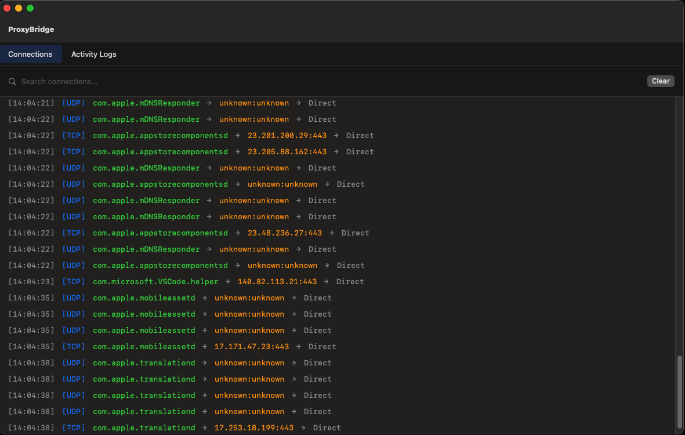
   
  <em>ProxyBridge GUI - Main Interface</em>

  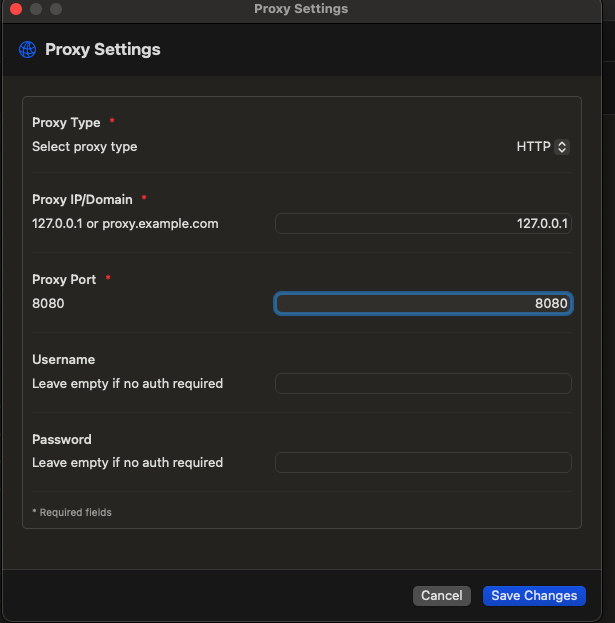
   
  <em>Proxy Settings Configuration</em>

  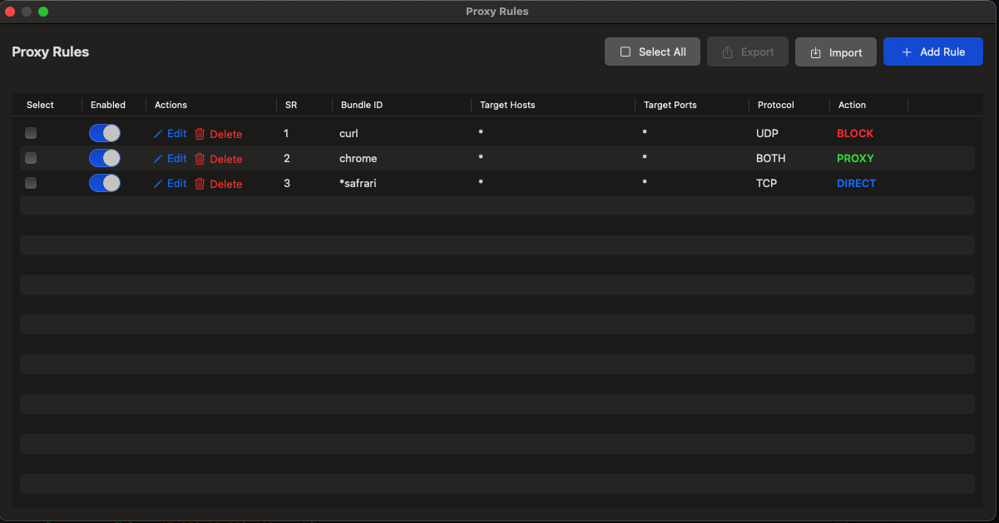
   
  <em>Proxy Rules Management</em>

  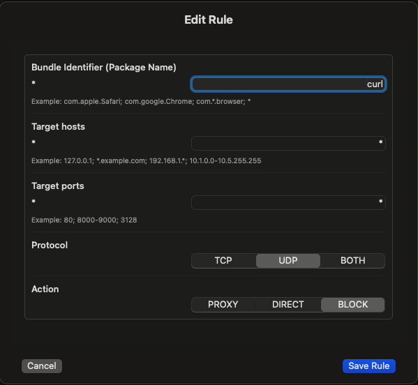
   
  <em>Add/Edit Proxy Rule</em>

### Windows

#### GUI

  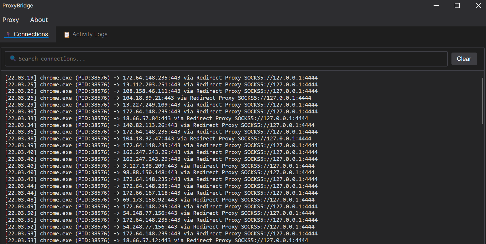
   
  <em>ProxyBridge GUI - Main Interface</em>

  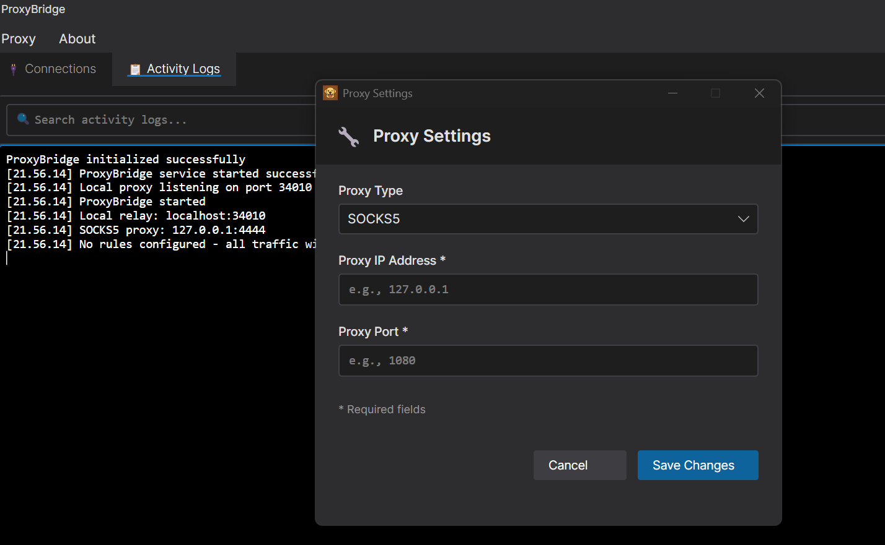
   
  <em>Proxy Settings Configuration</em>

  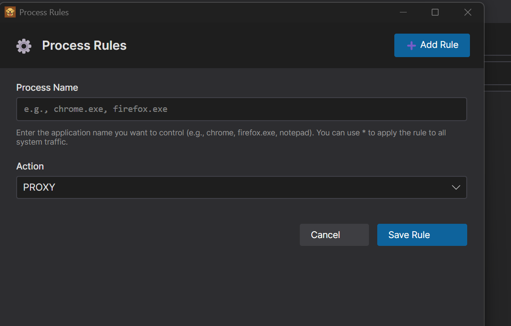
   
  <em>Proxy Rules Management</em>

  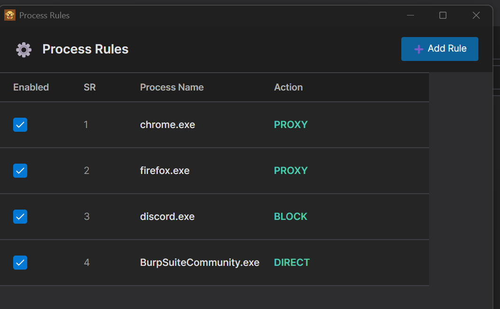
   
  <em>Add/Edit Proxy Rule</em>

#### CLI

  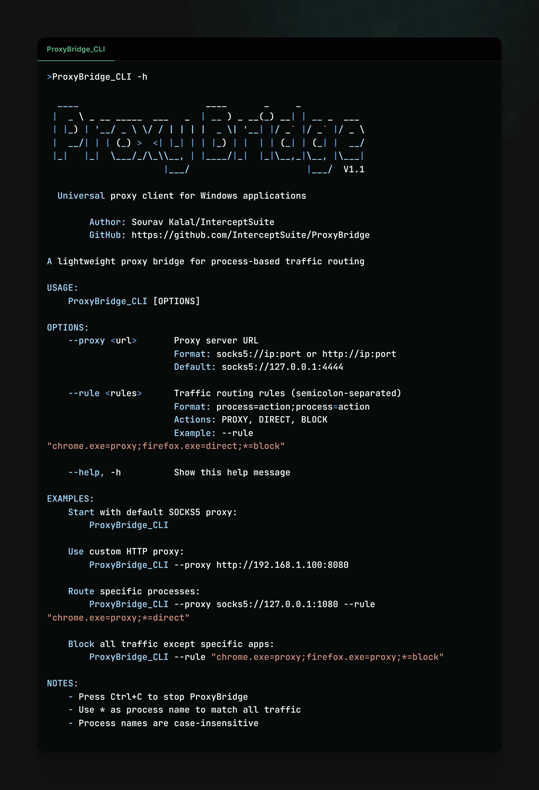
   
  <em>ProxyBridge CLI Interface</em>

### Linux

#### GUI

  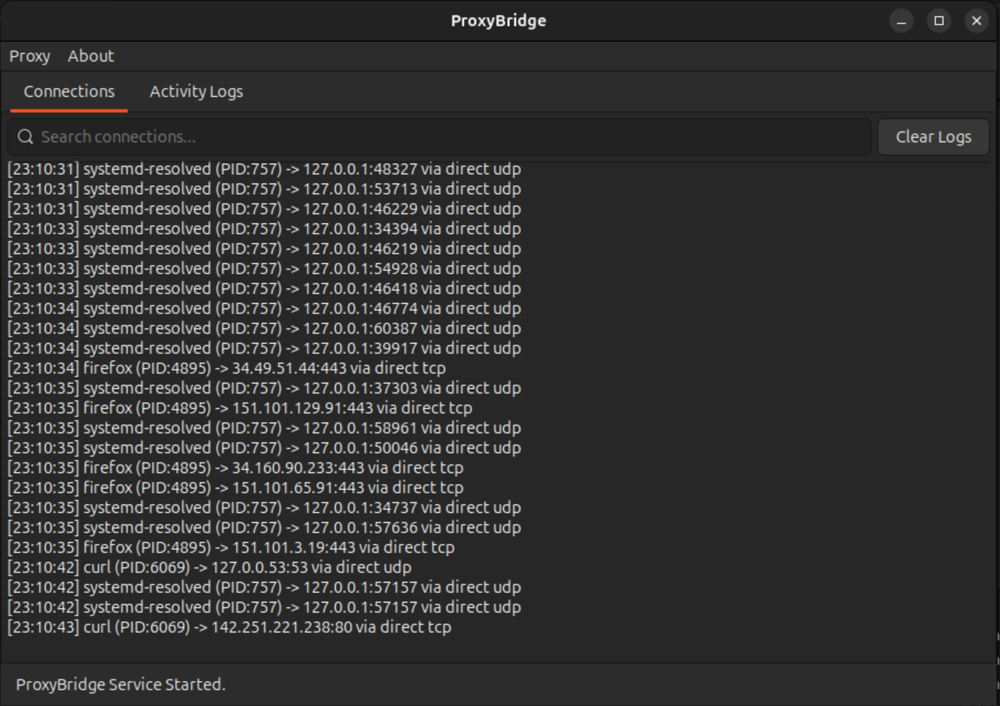
   
  <em>ProxyBridge GUI - Main Interface</em>

  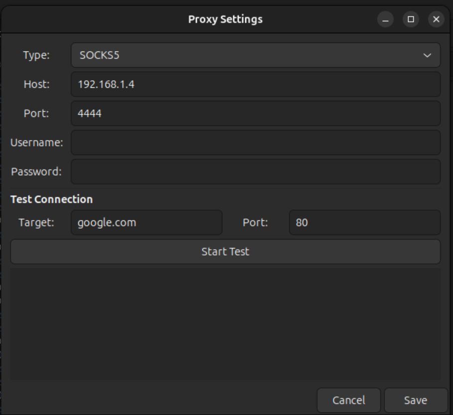
   
  <em>Proxy Settings Configuration</em>

  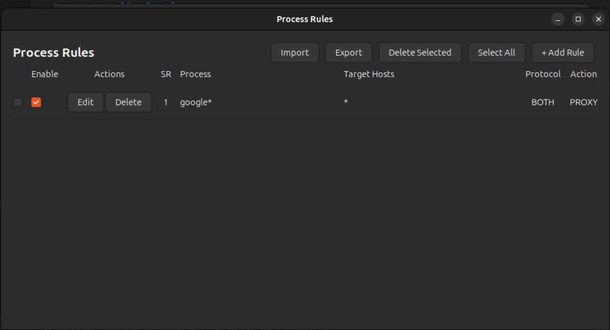
   
  <em>Proxy Rules Management</em>

  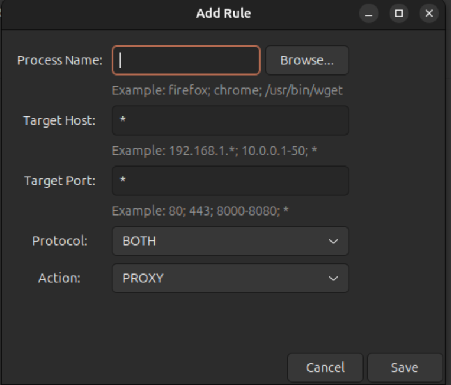
   
  <em>Add/Edit Proxy Rule</em>

#### CLI

  
   
  <em>ProxyBridge CLI Interface</em>

## Use Cases

- Redirect proxy-unaware applications (games, desktop apps) through InterceptSuite/Burp Suite for security testing
- Route specific applications through Tor, SOCKS5 or HTTP proxies
- Intercept and analyze traffic from applications that don't support proxy configuration
- Test application behavior under different network conditions
- Analyze protocols and communication patterns

## License

MIT License - See LICENSE file for details

## Author

Sourav Kalal / InterceptSuite

## Credits

**Windows Implementation:**
This project is built on top of [WinDivert](https://reqrypt.org/windivert.html) by basil00. WinDivert is a powerful Windows packet capture and manipulation library that makes kernel-level packet interception possible. Special thanks to the WinDivert project for providing such a robust foundation.

Based on the StreamDump example from WinDivert:
https://reqrypt.org/samples/streamdump.html

The Windows GUI is built using [Avalonia UI](https://avaloniaui.net/) - a cross-platform XAML-based UI framework for .NET, enabling a modern and responsive user interface.

**macOS Implementation:**
Built using Apple's Network Extension framework for transparent proxy capabilities on macOS.

**Linux Implementation:**
Built using Linux Netfilter NFQUEUE for kernel-level packet interception and iptables for traffic redirection. The GUI uses GTK3 for native Linux desktop integration.
